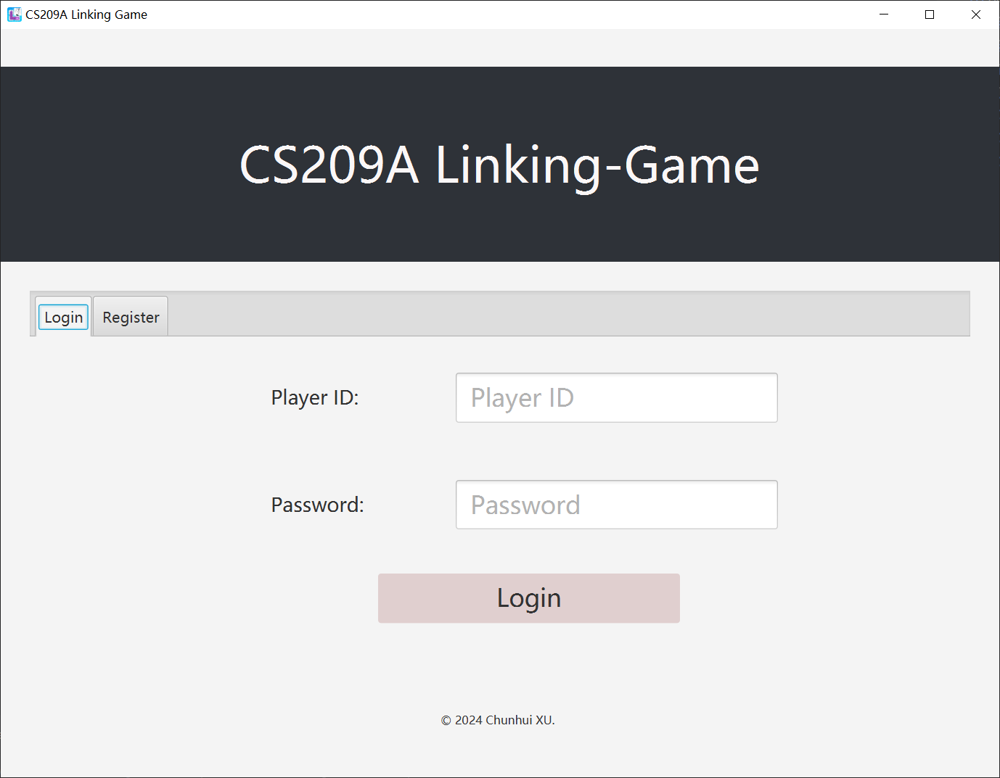
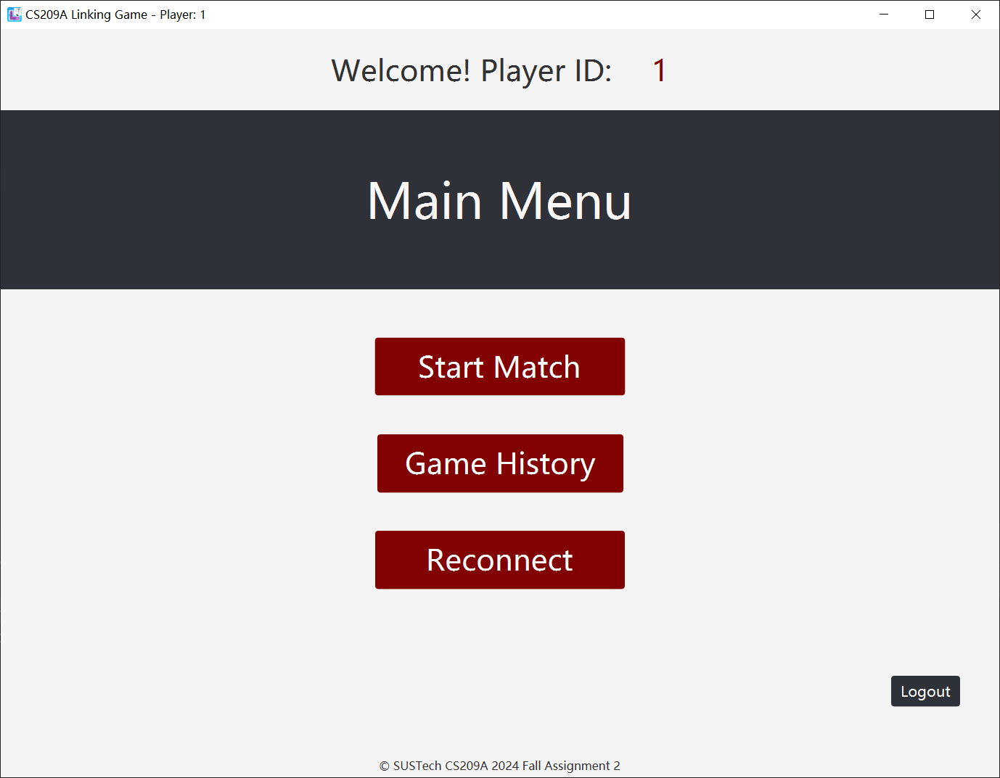
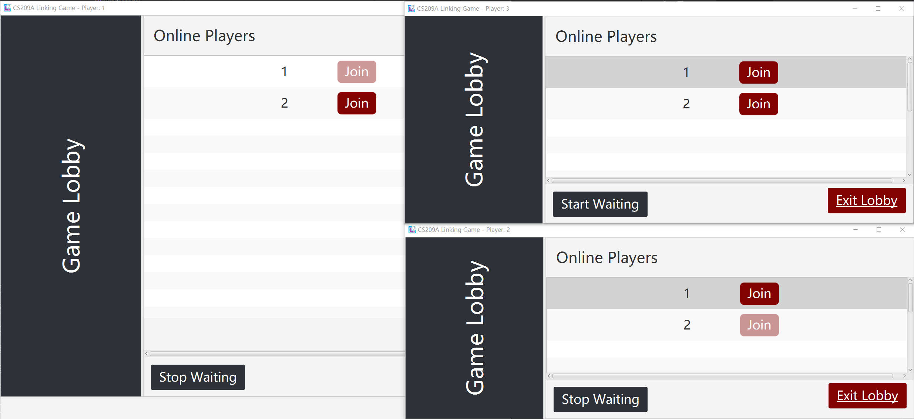
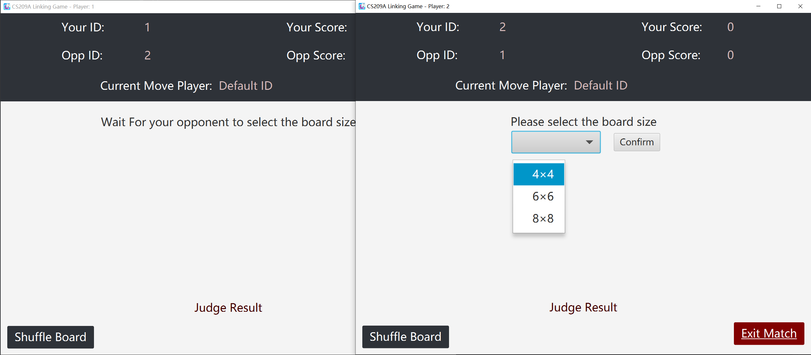
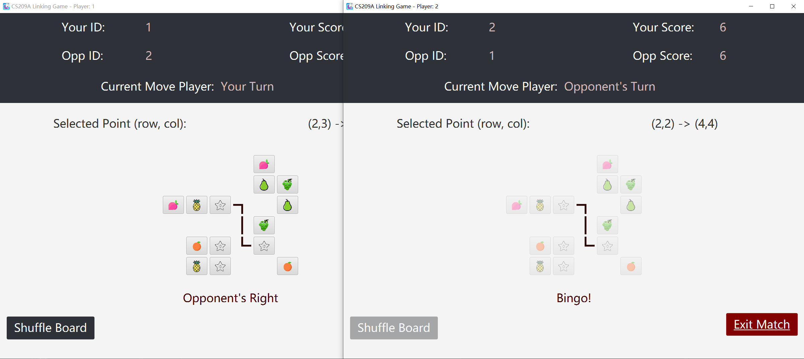
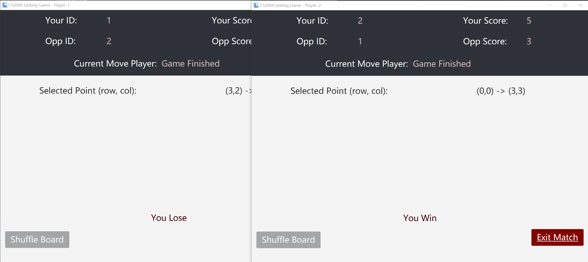
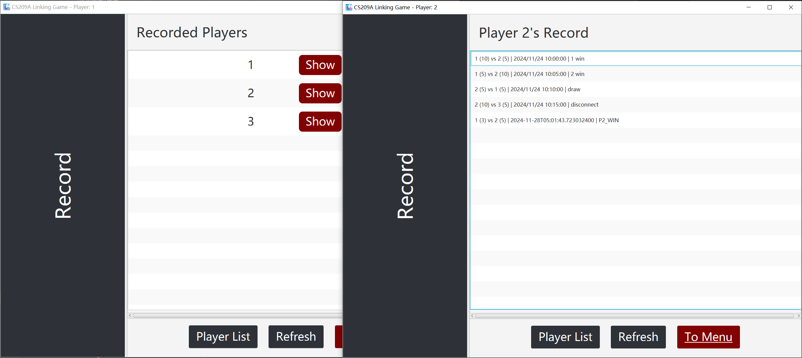

# SUSTech-CS209A-Linking-Game

(JavaFX 23 + Java socket) A Linking Game (a.k.a. '连连看') with simple online multiplayer functionality.

SUSTech CS209A 2024 Fall Assignment 2.

### Versions

- Main branch ( `main` ): Kotlin implementation version
- [Java implementation version](https://github.com/OctCarp/SUSTech-CS209A-LinkGame/tree/java-backup) ( `java-backup` branch), you can check this for Java native implementation.

For documentation, it is recommended to first refer to the `main` branch, as the documentation for the backup branch is no longer being updated, and there may be some minor errors in it.

### About

A toy game. I wrote it in a short time span, and by the end the project structure was a little messy. 

There may be some minor bugs that have not been addressed. 

After completing the Java version, I refactored the project into Kotlin with the help of JetBrains Intellij IDEA and LLM, exploring Kotlin's syntactic sugar.

Kotlin version may have more bugs (due to rewrites) or fewer bugs (as some issues from the Java version were addressed during refactoring).

It is not a native Kotlin project, and does not use features such as `coroutines`.

### Documentation

- [requirement.pdf](docs/requirement.pdf)
- [grading_criteria.xlsx](docs/grading_criteria.xlsx) or [grading_criteria_CHS.xlsx](docs/grading_criteria_CHS.xlsx)

I completed both the basic and bonus features.

### Modules

- [game-common](game-common/): Shared model components used by both the client and the server.
    - `model` : Different models for C/S transmission through `ObjectI/OStream` .
    - `packet` : General `Request` / `Response` model.

- [game-client](game-client/): JavaFX game client application.
    - `controller` : Controllers for JavaFX `.fxml` files.
    - `net` : Singletons for managing various types of client-side data.

- [game-server](game-server/): Java socket game server.
    - `net` : Singletons for managing different kinds of data for all clients.

### Login / Register

There are 3 pre-define users:

- "1" , "1"
- "2" , "2"
- "2" , "2"

### Main Menu

### Start Matching (Lobby)

### Choose Size

A random player to choose size.

### Link!

Lines key frame animation for both players.

You can shuffle for a new shape of grids.

### Game Result

### Match Record

No beautification.

